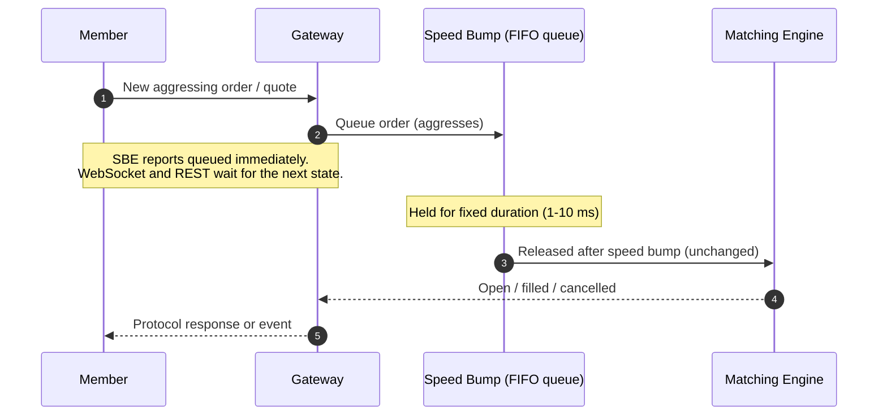
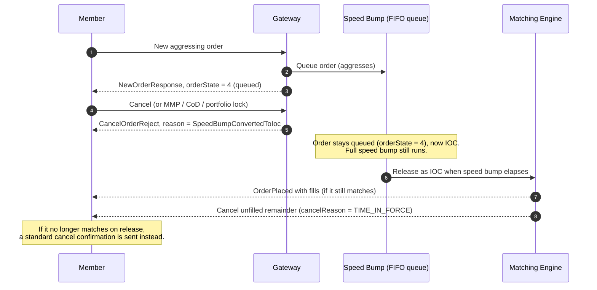
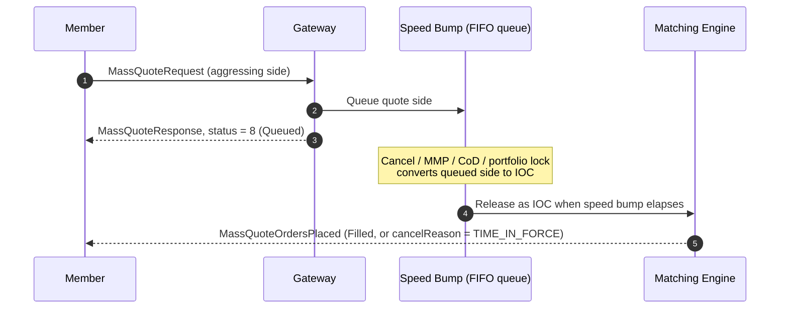

> ## Documentation Index
> Fetch the complete documentation index at: https://docs.deribit.com/llms.txt
> Use this file to discover all available pages before exploring further.

# Speed Bumps

> Speed bumps in Starbase API for options trading, including how aggressive orders are delayed and how market makers are protected from latency arbitrage.

## Overview

Speed Bumps will apply to all instruments, except the top 5 crypto perpetuals by volume (BTC, ETH, SOL, XRP, and HYPE, including BTC/ETH inverse perps). All other instruments (options, dated futures, other perps, and related multi-leg instruments) will have a fixed-length speed bump, configured to be in the 1-10 millisecond range. Any aggressive order or quote, that is, an order or quote that would immediately match, will be made pending by a fixed duration before being entered into the order book. No other member except the owner of the order or quote is informed that this order or quote is pending. Pending orders and quotes are stored in a FIFO queue. Any jitter on speed bump timing will not cause pending orders or quotes to overtake each other.

## Purpose

In the presence of a speed bump, any liquidity providing member has a fixed period of time to detect if their orders or quotes are stale due to newly available information and to send in cancellations of those orders or quotes. In other words, latency arbitrage that prices in information on sub-millisecond timescales is avoided. Market makers can tighten their bid-ask spreads as a result.

As Deribit's market will go from a sub-second latency exchange to a sub-millisecond exchange, we have deemed it necessary to protect our option market makers with a speed bump to make sure our liquidity can transition and deepen.

## How Speed Bumps Work

New orders and quotes will be speed bumped if they aggress. Cancellations will never be speed bumped. For amendments, see the table below:

|                               | **Resting**                                   | **Pending**                                   |
| ----------------------------- | --------------------------------------------- | --------------------------------------------- |
| **Order amended to aggress**  | Removed from book and made pending            | Made pending for speed bump duration again    |
| **Order amended to rest**     | Immediately amended                           | Immediately added to book                     |
| **Quote replaced to aggress** | Old quote removed and new quote made pending  | Old quote removed and new quote made pending  |
| **Quote replaced to rest**    | Old quote removed and new quote added to book | Old quote removed and new quote added to book |

The lifecycle of an aggressing order is: accepted by the gateway, held in the FIFO queue for the fixed speed bump duration, then released to the matching engine unchanged. How acceptance is exposed to the client depends on the protocol. The SBE gateway reports the queued state immediately, while WebSocket, REST, and FIX hide this intermediate state.

## Mass Quotes

Quotes can only be entered via `MassQuoteRequest`. Each quote in such a batch is speed bumped individually, per side. One side of a quote can be added to the book immediately while the other side remains pending.

## Member Speed Bump Limit

Each speed bump configuration enforces a maximum number of **live speed-bumped orders per member**. The limit is scoped to the member (not per portfolio), and is configured alongside the speed bump delay and queue capacity.

* Orders and quotes submitted without a member (for example Thunder or retail flow) do **not** count toward the limit and are exempt.
* Exceeding the limit rejects the new order or quote with `MEMBER_SPEED_BUMP_LIMIT_EXCEEDED` (SBE reject reason `29`; FIX `OrdRejReason` `69`).

## Cancelling Pending Orders

Cancelling a speed-bumped order or quote **converts it to IOC** rather than removing it immediately. When the speed bump period expires, it enters the book as IOC, attempts to fill, and any unfilled remainder is cancelled.

The following triggers all produce this IOC conversion:

* Single cancel (`CancelOrderRequest`) and mass cancels (`MassCancelRequest`, `MassQuoteCancelRequest`)
* Market Maker Protection (MMP) trigger
* Cancel on Disconnect (CoD)
* User-initiated portfolio lock

IOC conversion is intentional for MMP and portfolio lock: hard-cancelling pending aggressors would let clients use those triggers to pull speed-bumped orders. Clients that need to avoid unintended fills during an MMP freeze should use post-only order types. See [MMP and speed bumps](#mmp-and-speed-bumps) below.

`OrderPlaced` and `MassQuoteOrdersPlaced` do **not** carry a separate `timeInForce` field. Infer the IOC conversion from the subsequent status and `cancelReason` (typically `TIME_IN_FORCE` on a partial fill or cancel, or `Filled` if the IOC fully fills).

### Orders — message flow

For a single-order cancel, the exchange responds immediately with a `CancelOrderReject` carrying reason `SpeedBumpConvertedToIoc` (`8`). The order remains queued (`orderState = 4`).

Once the speed bump elapses:

* **Still matches**: `OrderPlaced` with any fills, then cancellation of the unfilled remainder (`cancelReason = TIME_IN_FORCE`).
* **No longer matches**: a standard cancel confirmation is sent.

If the order is already IOC — submitted as IOC or already converted — a subsequent cancel is rejected with `TimeInForce` (`7`).

### Mass quotes — message flow

Mass quotes are always submitted as GTC; there is no client-specified quote expiry. When a queued quote side is converted to IOC (cancel, MMP, CoD, or portfolio lock), the SBE flow is:

1. Immediate `MassQuoteResponse` with `bidStatus` / `askStatus` = `8` (Queued) for the speed-bumped side(s).
2. After the bump: `MassQuoteOrdersPlaced` with `status` and `cancelReason` set as applicable — for example `Filled`, or a cancel with `cancelReason = TIME_IN_FORCE` (possibly after a partial fill).

### Cancel arriving before the order

If a cancel reaches the matching engine before the order it targets (for example while the order is still awaiting its risk check in the pre-trade risk layer), the order is also treated as **IOC** upon release.

### MMP and speed bumps

When MMP triggers, resting MMP orders are cancelled and the group is frozen, but any speed-bumped aggressor already in the queue is converted to IOC and can still trade when released — including during the freeze interval. That means MMP trade limits (quantity / delta / vega) can be exceeded by a fill from a previously queued order.

Use post-only attributes if you need to avoid this path. The same IOC conversion applies to portfolio lock.

## Additional Behavior

**Applies to all API interfaces**: The speed bump applies regardless of which gateway or protocol is used. Orders and quotes submitted via the SBE gateway, REST API, or FIX gateway are all subject to the same speed bump.

**Full duration always runs**: The speed bump duration is always served in full based on market conditions at the time of submission. If the opposing liquidity that triggered the speed bump is cancelled before the bumped order is released, the order still completes its full bump period before entering the book. The matching engine does not re-evaluate pending orders when the order book changes.

**Event-driven release**: The speed bump is not a precise hardware timer. Pending orders are checked for release on every incoming message. In practice this means the delay is very close to the configured duration, but may be marginally longer during quiet periods. This has no effect on execution outcomes — any message that would allow the order to release would itself have triggered the evaluation.

**WebSocket and REST visibility**: A speed bump is exposed as additional response latency, not as an order-state transition. A request does not return `order_state = "speed_bumped"`; it waits until the order reaches another state such as `open`, `filled`, or `cancelled`. The intermediate state is also suppressed from `users.changes.*.*` notifications. A speed-bumped order may temporarily appear with `order_state = "speed_bumped"` when querying open orders.

## Self Match Prevention and Speed Bumps

When a self-match is detected on a taker order that is currently speed-bumped and was submitted via the SBE gateway, the SMP mode is overridden to `CANCEL_MAKER` regardless of the value in the request. Orders submitted via the WebSocket API may use `CANCEL_TAKER` regardless of speed-bump state.

See [Self Match Prevention](/starbase/smp) for details.

## Post-Only Attributes

To guarantee that trading members aiming to provide passive liquidity are not encumbered by the speed bump, Starbase has post-only-reject and post-only-amend order and quote attributes. These attributes guarantee an avoidance of the speed bump.

## Message Flow During Speed Bump

### SBE Gateway

When a new order or quote aggresses and is speed bumped, the gateway immediately acknowledges the request with a queued status. A follow-up unsolicited message is sent once the speed bump period expires and the order or quote is entered into the book.

| Event                         | Immediate response                                                                        | Follow-up unsolicited message |
| ----------------------------- | ----------------------------------------------------------------------------------------- | ----------------------------- |
| New order speed bumped        | `NewOrderResponse (200)` with `orderState = 4` (queued)                                   | `OrderPlaced`                 |
| Amend causes order to aggress | `AmendOrderResponse (210)` with `orderState = 4` (queued)                                 | `OrderPlaced`                 |
| Quote side speed bumped       | `MassQuoteResponse (230)` with `bidStatus` / `askStatus` = `8` (Queued) per affected side | `MassQuoteOrdersPlaced`       |

`OrderPlaced` includes a fills repeating group (`numberOfFills > 0`) when the order matches immediately upon book entry. See [Unsolicited Events](/starbase/unsolicited-events) for the full message specifications.

### FIX Gateway

The FIX gateway suppresses the queued speed-bump state. It does not send an `ExecutionReport (8)` with `OrdStatus = A` (Pending New) or `OrdStatus = E` (Pending Replace) for this transition. The first report reflects the next externally visible state, such as New (`0`), Partially Filled (`1`), Filled (`2`), or Canceled (`4`).

See [Execution Reports](/fix-api/production/execution-reports) for the full field specifications.

## Related topics

- [Starbase API Changelog](/changelogs/starbase.md)
- [Market Maker Protection (MMP)](/starbase/mmp.md)
- [Mass Cancel](/starbase/mass-cancel.md)
- [FIX Drop Copy API](/starbase/fix-drop-copy-api.md)
- [Self Match Prevention (SMP)](/starbase/smp.md)
